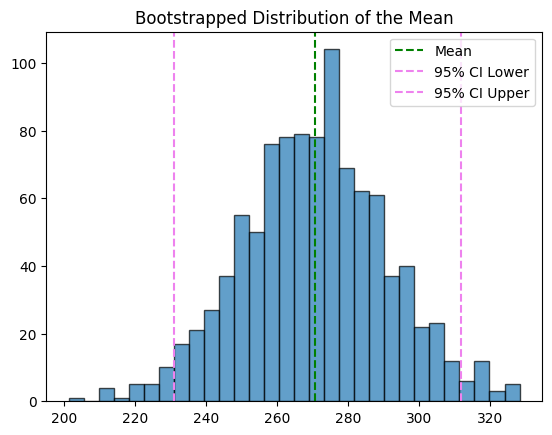
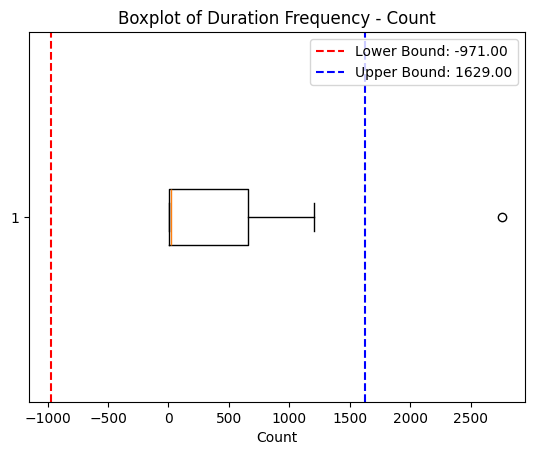
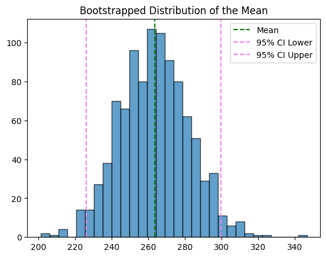

Pietro Masolini  - 2023/2024 - University of Milan - Computer Science - Business Information Systems - [Github :globe_with_meridians: Repository](https://github.com/roccobalocco/AvodingTrafficFines)

<hr>

# Road Traffic Fine Analysis

# Introduction:

The aim of this project is to leverage process mining techniques to enhance the management of Road Traffic Fines (RTF). We start by analyzing the event logs collected by the police information system to understand the statistical properties that distinguish cases. 

The primary objective is to *map out the process from the event logs and identify an optimal process*. We are going to analyze the existing process in order to identify inefficiencies and propose improvements to enhance overall process performance.

# Data Presentation:

## Application Area

This case study focuses on the management and optimization of RTF through the application of process mining techniques. The application area encompasses the end-to-end life-cycle of traffic fine management, starting from the issuance of fines to their eventual resolution through payment, appeal, or credit collection.

## Actors

There are some assumption that I made about the actors involved in the road traffic fine management:

1. **Traffic Police Officers**: Responsible for issuing fines to violators based on traffic infractions.
2. **Administrative Staff**: Handle the processing, recording, and administrative follow-up of the fines.
3. **Violators**: Individuals who receive fines and are required to respond through payment, appeal, or other actions.
4. **Credit Collection Agencies**: Engage in the collection of unpaid fines that are sent for credit collection.
5. **Judicial Authorities**: Oversee the appeal process when violators contest fines.
6. **Prefecture**: Administrative body that handles appeals and other legal processes related to traffic fines.

## Dataset Available

The dataset used in this analysis is derived from event logs recorded by the police information system. These logs capture detailed records of the various activities and transitions that occur within the traffic fine management process. The dataset is provided in the `XES` (eXtensible Event Stream) format, a standard format for event logs in process mining.

## Dataset Characteristics

- **Event Logs**: Each log entry corresponds to a specific activity related to a traffic fine case, including timestamps, activity names, case identifiers, and other relevant attributes.
- **Number of Traces**: $150'370$ traces are recorded, representing individual cases of traffic fines.
- **Number of Events**: $561'470$ events are captured, detailing each step taken in the process.
- **Events per Trace**: On average, there are $3.734$ events per trace, with a minimum of $2$ and a maximum of $20$ events per trace.

## Attributes

The dataset includes various attributes to support the analysis:

- **Activities**: Key activities captured in the dataset include `Create Fine`, `Send Fine`, `Payment`, `Send for Credit Collection`, `Send Appeal to Prefecture`, among others.
- **Start and End Activities**: The process typically starts with the `Create Fine` activity and can end with several activities such as `Payment`, `Send for Credit Collection` or `Send Appeal to Prefecture`.
- **Timestamps**: Each event includes a time-stamp to track the chronological order and duration of activities.
- **Attributes**: Additional attributes in the dataset include the fine amount, dismissal status, and duration of each case from start to end.

## Peculiarities

The dataset presents several peculiarities that are critical for the analysis:

1. **Variability in Process Paths**: The process exhibits a high degree of variability, with multiple potential paths from the  creation of a fine to its resolution. This variability is driven by factors such as the violator's response (payment, appeal, or non-compliance) and the administrative actions taken by the authorities.
2. **Bottlenecks and Delays**: Certain activities, particularly those involving credit collection and appeals, exhibit significant delays and bottlenecks. These delays impact the overall efficiency of the process and are key areas for potential optimization.
3. **Checkpoint Activities**: Activities such as `Send Fine` serve as transitional checkpoints rather than true endpoints. These activities often precede critical actions like payment or credit collection, indicating their role in the intermediate stages of the process.
4. **Process Compliance**: Analyzing the compliance of actual event logs with the theoretical process model reveals deviations and non-conformances. Understanding these deviations helps in identifying areas where the actual process diverges from the intended workflow.

# Data collection:

The project begins with importing the `XES` file and converting it into a pandas DataFrame using the pm4py library. This transformation allows for more straightforward analysis and manipulation.

```python
original_event_log = pm4py.read_xes("../Assets/Road_Traffic_Fine_Management_Process.xes")
orginal_data_frame = pm4py.convert_to_dataframe(original_event_log)
```

Then I decided to take a look into the dataframe, obtaining the start and the end activities:

```python
start_activities = pm4py.get_start_activities(original_event_log)
end_activities = pm4py.get_end_activities(original_event_log)
```

An RTF process starts with the `Create Fine` activity and can conclude in several ways, as we elicited above. Although many cases end with `Payment`, a significant number also end with activities like `Send for Credit Collection` or `Send Appeal to Prefecture`.

| Description      | Activities                                                   |
| ---------------- | ------------------------------------------------------------ |
| Start activities | *Create Fine* (150370)                                       |
| End activities   | *Send Fine* (20755)<br />*Send for Credit Collection*(58997)<br />*Payment* (67201)<br />*Send Appeal to Prefecture* (3144)<br />*Appeal to Judge* (134)<br />*Notify Result Appeal to Offender* (86)<br />*Receive Result Appeal from Prefecture* (53) |

# Initial considerations:

Before starting to manipulate the provided dataset I took a first glance at the data provided, using both python :snake: and PMTK.

## Using python:

It's crucial to recognize that activities like `Send Fine` and `Send for Credit Collection` are checkpoints rather than true endpoints. For example, `Send Fine` often precedes `Payment` or `Send for Credit Collection`.

Exploring activity percentages further confirms that `Send Fine` is a transitional activity. Conversely, `Send for Credit Collection` often marks the end of a process, as evidenced by its frequency in the logs.

Based on my analysis of the percentage of all activities without considering them as Start or End points, I confirmed my previous thought that `Send Fine` is primarily a checkpoint in the traces. This activity is recorded approximately $20'000$ times as an end activity and $100'000$ times in total.

However, I cannot say the same for the `Send for Credit Collection` activity, as the numbers indicate that it is indeed a final activity.

Another discovery from this initial analysis is that the activities `Add Penalty` and `Insert Fine Notification` appear to be part of most traces of an RTF.		

```python
activities_number = original_event_log.get("concept:name").value_counts()
bars = plt.barh(activities_number.index, activities_number.values)
plt.bar_label(bars, labels=[str('%.2f'%((x/original_event_log.get("concept:name").count())*100)+'%') for x in bars.datavalues])
plt.show() #the plot is below
```


## Using PMTK:

The dataset was explored to gain insights into the number of events per case and the most common cases. This helped in identifying useful information and filtering out outliers that did not contribute significant insights.

I have listed, section per section, all the information that I have watched:

### Log Summary


The summary adds information regarding the number of events per case, revealing the most common cases and helping me to understand which information are useful and which are not.

Once again, `Create Fine` is confirmed as the only starting activities for each case, the cases don't involve much activities, $3.73$ per case, with a maximum in $9.5$ (excluding outliers). `Send Fine` is the third activity for presence as end activity, but it is only because the cases aren't yet closed, this activity is also the second per occurrence.

Then I had a look at the outliers, which doesn't provided any useful information.

### Throughput Time:


A substantial percentage of events conclude quickly, but many take longer, even excluding outliers. This suggests a need to optimize certain parts of the process. For instance, initiating credit collection promptly after adding a penalty could significantly reduce resolution times.

Sorting the bottlenecks by duration shows that the activities who take a long amount of time don't occur much, the only real bottleneck here is the `Add Penalty`  into `Send for Credit Collection`, but this kind of state occur only if a violator didn't pay penalty on time, and this time is really long. 

To identify the real bottlenecks I have sorted the *Bottlenecks* section by occurrences:


Even if I consider the issue between the creation of a fine and the actual fine, the bottleneck in terms of time doesn't seem too significant. Instead, the highlighted one can be really relevant for my analysis. It suggests that *if credit collection was done right after adding a penalty, we could save a significant amount of time*, this means occupy some police officer for the credit collection, so increasing the staff can be a good point.

Additionally, I discovered that `Send for Credit Collection` is mostly a final state, with only 16 occurrences where it is involved as a transition activity. This means that a small amount of violator refuse to pay in front of police officers, and increase the trust in my suggestion about the increasing of the staff.


### Dotted Chart:

First of all I provide the legend:


Then the chart:


1. **`Payment` and `Credit Collection` (<span style="color: red">Red</span> and <span style="color: pink">Pink</span> Dots):**
   - There are significant <span style="color: red">red</span> and <span style="color: pink">rink</span> dots scattered throughout the chart, with clusters or drops occurring at specific periods.
   - The spikes in <span style="color: red">red</span> dots (`Send for Credit Collection`) suggest periods where many cases were escalated for collection simultaneously, possibly due to delayed payments.
   - The accompanying <span style="color: pink">pink</span> dots indicate payments made, possibly before or after the credit collection process.
2. **`Appeals to Prefecture` and `Appeals to Judge` (<span style="color: orange">Orange</span> and <span style="color: yellow">Yellow</span> Dots):**
   - <span style="color: orange">Orange</span> (`Send Appeal to Prefecture`) and <span style="color: yellow">yellow</span> (`Appeal to Judge`) activities are less frequent but present throughout the timeline.
   - Clusters of these activities, often towards the later stages of case progression, suggest cases where individuals are appealing against fines, possibly after initial fines are imposed.
3. **`Create Fine` and `Send Fine` (<span style="color: lightblue">Light Blue</span> and <span style="color: darkblue">Dark Blue</span> Dots):**
   - These activities (creating and sending fines) are the starting points of many cases, consistently distributed across the time-line.
   - This indicates a steady generation and processing of fines over the years.
4. **Significant Delays or Bottlenecks:**
   - There are instances where cases appear to stagnate, indicated by the density of specific activities clustering together, followed by long periods of inactivity.
   - Such patterns might indicate bottlenecks in the processing or appeals system, leading to delayed resolutions.

#### Patterns and Anomalies:

1. **Increased Activity Around Certain Periods:**
   - The chart shows that certain periods experience higher activity levels, particularly around $2002$, $2004$, and $2012$. These could be due to policy changes, new regulations, or system updates.
   - Sudden drops or gaps (e.g., fewer dots in specific years) may indicate systemic issues or changes in the process or event logging.
2. **Outliers:**
   - There are occasional outliers where the case index sharply changes, and a sudden cluster of dots appears. These might represent anomalies or exceptional cases that required special handling or more steps than usual.

### Horizon Chart:


It confirms the periodicity of certain activities but indicates peaks rather than a consistent periodic pattern for others. It also confirms the periodicity of `Send for Credit Collection` but not the periodicity of `Send Appeal to Prefecture`, that just have a peak in $2012$.

### Transition Matrix:


The matrix above highlights the transition patterns within the system. It shows that `Payment` frequently transitions back to itself, indicating that payments can be made in installments. The `Create Fine`activity serves as a significant starting point for many processes, while the `Send for Credit Collection`activity is not commonly used as a transition point in the work-flow.


By analyzing the performance filter in conjunction with the transition matrix, we can clearly identify bottlenecks, particularly those involving the `Send for Credit Collection` activity. The key bottlenecks occur in the following transitions:

- `Add penalty` → `Send for Credit Collection`
- `Create Fine` → `Send for Credit Collection`
- `Insert Fine Notification` → `Send for Credit Collection`
- `Send Fine` → `Send for Credit Collection`

These transitions highlight areas where the process slows down, suggesting inefficiencies in moving cases to the credit collection stage.

Additionally, while the transition from `Create Fine` → `Insert Fine Notification` also takes some time (around $5$ months), the delay appears to be less severe, likely due to bureaucratic steps involved. However, the overall impact of this delay is less significant compared to the bottlenecks related to credit collection.

Addressing these bottlenecks, particularly in the transitions to `Send for Credit Collection`, could lead to more efficient processing and quicker resolution of cases. In conclusion, this analysis suggests a need to reduce the time it takes to initiate the credit collection process, such as dispatching police officers or the responsible authority to collect outstanding payments.

### Variant Explorer:


In the image above, I've selected the variants that will be considered in my analysis, I've chosen to consider only 9 variants because they cover roughly 99% of all the traces in the dataset. By concentrating on these dominant variants, the analysis remains focused and relevant, capturing the most common patterns and behaviors while minimizing the impact of outliers or less frequent cases.

### Process Model:

Due to the high variability I made visible a process model that consider the $75$% of the cases to make it more readable:


This model is not a surprise if we consider that the first three variants cover about 75%.

# The Knowledge Uplift Trail:

The KUT is used to turn raw data into insights full of meanings; it involves various steps that let us better understand the informations that those data provide. Some of the techniques of this methodology are listed below:

1. **Cleaning Data**, this step standardize data and fills or drops its missing values
2. **Filtering Data**, filters out some data in order to keep only the cases that meet specific conditions
3. **Descriptive Analysis**, it uses some tools to help understanding distribution and data characteristics 
4. **Process Mining**, it uses process mining techniques to discover the process
5. **Strategies** to improve and monitor the results of the previous steps

These are the steps that I have followed during the realization of this analysis:

| Step | Input                                            | Analytics            | Acquired Knowledge                                           | Type of Knowledge | Output                                                       |
| ---- | ------------------------------------------------ | -------------------- | ------------------------------------------------------------ | ----------------- | ------------------------------------------------------------ |
| 1    | Event Logs                                       | Data Cleaning        | Standardization of `dismissal` and `amounts`, filling of `na` values | Descriptive       | Cleaned Event Logs                                           |
| 2    | Cleaned Event Logs                               | Descriptive Analysis | Data Filtering                                               | Descriptive       | Traces with a maximum of 9 cases, variants number reduced to 9, cases with a duration less than 1494.6 days |
| 3    | Filtered Cases                                   | Descriptive Analysis | Insights and duration plot of the cases (the same for paid and unpaid distinction) | Descriptive       | Data distribution parameters                                 |
| 4    | Duration frequency of cases                      | Statistical Testing  | Cases aren't normal distributed                              | Descriptive       | Statistical confidence on the data distribution              |
| 5    | Filtered Cases                                   | Process Mining       | Process Discovery                                            | Descriptive       | Petri nets describing the process of the filtered data using heuristics method |
| 6    | Filtered Cases                                   | Process Mining       | Process Discovery                                            | Descriptive       | Petri nets describing the process of the filtered data using inductive method |
| 7    | Filtered Cases divided for end activities        | Process Mining       | Process discovery                                            | Descriptive       | Directly Follows Graphs of cases for each end activities     |
| 8    | Inductive Petri Net of original event log        | Prescriptive         | Process optimization and simplification                      | Prescriptive      | Diagnostics alignments of variants on the filtered log compared to the original |
| 9    | Net of original event log and filtered event log | Conformance Checking | Calculate the deviation of cases from the objective process  | Descriptive       | Fitness and Fitness Distribution on both original event log and filtered log |
| 10   | Fitness                                          | Prescriptive         | Conformance to the To-Be process while identifying possible weaknesses | Prescriptive      | Further improvements                                         |

## 1) Data Cleaning:

Standardized values for dismissal and financial amounts to facilitate interpretation.

```python
def classify_dismissal(row):
    if row['dismissal'] in ['#','G']:
        return 'Y'
    elif row['dismissal'] == 'NIL' or pd.isna(row['dismissal']):
        return 'N'
    else:
        return '?'
original_event_log['dismissal'] = original_event_log.apply(classify_dismissal, axis=1)
```

```python
def classify_amounts(row):
    if row['concept:name'] == 'Create Fine' or row['concept:name'] == 'Add penalty':
        return row ['amount']
    elif row ['concept:name'] == 'Send Fine':
        return row['expense']
    elif row ['concept:name'] == 'Payment':
        return row['paymentAmount']
    else:
        return 0
original_event_log['amount'] = original_event_log.apply(classify_amounts, axis=1)
```

Filling the `na` values with `None` to avoid dropping rows:	

```python
original_event_log=original_event_log.fillna(0)						
```

## 2) Data Filtering:

Next, I explored the dataset to examine the number of activities per trace, the variants that distinguish the dataset, and the duration of the traces in terms of days. Based on this analysis, we will refine the dataset with the following criteria:

1. **Maximum number of activities per trace**: Set to $9$ (since the box plot maximum is $9.5$, this criterion will trim the dataset effectively).
2. **Variants coverage**: Consider only the variants that cover at least $0.24$% of the cases in the event log. This way, we will cover approximately $98.6$% of all event logs.
3. **Maximum trace duration**: Set to $1'494.6$ days (according to the box plot maximum).

```python
# Filtering by the number of activities per trace
filtered_log = pm4py.filter_case_size(original_event_log, 1, 9)
# Filtering for the variants (we will cover ~98.6% of all of the event logs this way)
filtered_log = pm4py.filter_variants_top_k(filtered_log, 9)
# Filtering for duration on the remaining traces
case_durations = pm4py.get_all_case_durations(filtered_log)
# the durations are in seconds, so we need to convert them to days 
max_duration = ((1494.6*24)*60)*60
filtered_log = pm4py.filter_case_performance(filtered_log, min_performance=0, max_performance=max_duration)
```

## 3-4) Statistical Analysis:

The main goal of this paragraph is to obtain descriptive statistics on the data distributions.

### `Create Fine` - `Send Fine`:

One of the critical factor that determines if a case is a success is the period starting from the creation of a fine and its shipping. 

The scatter plot below shows the relation between the difference in days (that pass between creating a fine and sending it) and the frequency of them.


I also calculated this values (in days):

- **Mean of the differences**: 87.46225904371532
- **Median of the differences**: 87.0
- **Sample Standard Deviation**: 42.452027538816836

The *central tendency* suggests that fines are shipped within ~87 days with a variability states by the *standard deviation* of ~42 days.

Before trying to understand if the distribution is of type *normal*, I have splitted the cases into **Paid** and **Unpaid**, to see if those two groups follow the same:

### Paid `Create Fine - Send Fine`:


- **Mean of the differences**: 87.8281702374059
- **Median of the differences**: 89.0
- **Sample Standard Deviation**: 42.167763832413875

### Unpaid `Create&Send Fine`:


- **Mean of the differences**: 87.47244938665602 
- **Median of the differences**: 87.0 
- **Sample Standard Deviation**: 42.64077368893452

There aren't significant differences between the two distributions showed above, so I performed two different test for determine if this is a *normal distribution*:

```python
#perform Shapiro-Wilk test for normality
S_TestResult = shapiro(duration_frequency["Count"])
# Shapiro-Wilk pvalue: 1.1639578788109431e-25

#perform Kolmogorov-Smirnov test for normality
K_S_TestResult= kstest(duration_frequency["Count"], 'norm')
# Kolmogorov-Smirnov pvalue: 2.704684863512192e-297

if K_S_TestResult.pvalue > 0.05 and S_TestResult.pvalue > 0.05:
    print("There is not enough evidence to reject the null hypothesis that the data is normally distributed.")
else:
    print("The data is not normally distributed.")
```

Both the test, *Shapiro-Wilk* and *Kolmogorov-Smirnov*, returned p-values less than the threshold of 0.05, that states that the data *cannot be considered normally distributed*.

Moreover, the data *are not normally distributed* for both the **paid** and the **unpaid** cases.

### Better understanding Data Distribution by Bootstrapping:

Bootstrapping is useful for understanding the distribution of my data, especially because the assumption of normality doesn't hold. It involves repeatedly re-sampling of the data with replacement and calculating a statistic on each re-sample, usually mean $\or$ median $\or$ variance, that permits approximation on the distribution. 

 I used the following code to provide:

- **Histogram Plot**, a visual representation of the distribution of the bootstrapped means.
- **Confidence Interval**, tells us the range in which the true mean is likely to fall with a $95$% condidence
- **Bootstrap Mean**, mean of the bootstrapped samples and gives us an estimate that accounts for the underlying variability in your data.

```python
from sklearn.utils import resample

# my data
data = np.array(duration_frequency["Count"])

# Function for bootstrapping
def bootstrap_statistic(data, n_iterations=1000, statistic=np.mean):
    bootstrap_samples = []
    for _ in range(n_iterations):
        sample = resample(data)
        stat = statistic(sample)
        bootstrap_samples.append(stat)
    return np.array(bootstrap_samples)

# Perform bootstrapping to estimate the mean distribution
bootstrap_means = bootstrap_statistic(data, statistic=np.mean)

# Calculate the 95% ci
ci_lower, ci_upper = np.percentile(bootstrap_means, [2.5, 97.5])

print(f"Bootstrap Mean: {np.mean(bootstrap_means):.2f}")
print(f"95% Confidence Interval: [{ci_lower:.2f}, {ci_upper:.2f}]")

# Plot the bootstrapped distribution
plt.hist(bootstrap_means, bins=30, edgecolor='k', alpha=0.7)
plt.axvline(np.mean(bootstrap_means), color='green', linestyle='--', label='Mean')
plt.axvline(ci_lower, color='violet', linestyle='--', label='95% CI Lower')
plt.axvline(ci_upper, color='violet', linestyle='--', label='95% CI Upper')
plt.title("Bootstrapped Distribution of the Mean")
plt.legend()
plt.show()
```

- **Bootstrap Mean**: $270.62$
- **95% Confidence Interval**: [$230.86$, $311.77$]



#### Interpretation:

The *Confidence Interval* (CI) shows the uncertainty around our estimate, a CI like this suggest more variability in our data. We can say that the average duration of cases `Create Fine` - `Send Fine` is about $270.62$ days, but it depends on the sample variation so the true average can rely on the CI.

The bootstrapping process provided a reliable estimate of the mean and the range within which the true mean likely falls, considering the inherent variability of our data.

The previous results were interpreted as following:

- **Mean of the Differences**: ~ $87$
  It takes about $87$ days between when a fine is created and when it is sent
- **Median of the Differences**: ~$87$
  The median is close to the mean, it suggests that the data might be symmetrically distributed around the mean
- **Sample Standard Deviation**: ~$42$
  This value states the variability of my data, moreover it states that the closeness of mean and median doesn't indicate the consistency of the events.
  The spread of the standard deviation suggests that there may be some outliers or significant delays and might indicate areas were process efficiency could be improved.

The large difference between the means suggests that the dataset have a non normal distribution, which affects the traditional mean more significantly.

The CI from the bootstrap method provides more information than the standard deviation, offering both a measure of central tendency and the uncertainty around it. The wide interval further corroborates the high variability indicated by the standard deviation.

The much higher bootstrapped mean implies that there are likely extreme values or skewed distribution influencing the data.

#### Excluding outliers:



This box-plot shows where the outliers values begin, so I excluded those values and re-compute the normality test and the bootstrapping method:

- **Bootstrap Mean**: $264.72$
- **95% Confidence Interval**: [$227.12$, $303.20$]



The data are still not normally distributed, but the *Confidence Interval* has been reduced, however the reduction is not significant and it follows that the distribution is skewed (in this case is skewed right).

A right-skewed distribution is also called positive-skew distribution as we see on the box-plot above, so we have a bolder presence of extreme values on the right side of our distribution.

## 5-6) Process Discovery:

To summarizes the most frequent observed variants I realized the following table:

| Variant                                                      | Count |
| ------------------------------------------------------------ | ----- |
| 'Create Fine', 'Send Fine', 'Insert Fine Notification', 'Add penalty', 'Send for Credit Collection' | 56359 |
| Create Fine', 'Payment'                                      | 46371 |
| 'Create Fine', 'Send Fine'                                   | 20385 |
| 'Create Fine', 'Send Fine', 'Insert Fine Notification', 'Add penalty', 'Payment' | 9519  |
| 'Create Fine', 'Send Fine', 'Insert Fine Notification', 'Add penalty', 'Payment', 'Payment' | 3736  |
| 'Create Fine', 'Send Fine', 'Insert Fine Notification', 'Payment', 'Add penalty', 'Payment' | 3301  |
| 'Create Fine', 'Send Fine', 'Payment'                        | 3127  |
| 'Create Fine', 'Send Fine', 'Insert Fine Notification', 'Insert Date Appeal to Prefecture', 'Add penalty', 'Send Appeal to Prefecture' | 2273  |
| Create Fine', 'Send Fine', 'Insert Fine Notification', 'Add penalty', 'Payment', 'Send for Credit Collection' | 1508  |

How previously said, I have choose to maintain in the data only the top 9 variants. The majority of these variants terminates into the `Payment` activity, to be precise while considering the total number of cases the $45.06$% terminate on a `Payment`, while $39.48$% ends on `Send for Credit Collection`.

I used the following techniques, from pm4py process discovery, to provide a global view of these variants:

- **Heuristic miner**, that extends the **alpha miner** by including frequency and dependency metrics to improve the noise handling, by considering the most significant patterns in the Event Log:

  

- **Inductive miner**, that works recursively, dividing the Event Log into smaller pieces until simple models can be discovered and combined:

  	

These Petri Nets reflect what we have seen in the table above in a graphical way, moreover it can be great to combine the variants into smaller groups that shares the same end activity, to have a better look at the flow of the process, with the direct follow graph:

### `Send for Credit Collection`


### `Send Fine`


### `Payment`


### `Send Appeal to Prefecture`


## 8-9) Conformance Checking:

By comparing the filtered event logs (AS-IS) to the theoretical model (TO-BE), we assess process compliance.

```python
#Find diagnostic table
net, im, fm = pm4py.discover_petri_net_inductive(original_event_log, activity_key='concept:name', case_id_key='case:concept:name', timestamp_key='time:timestamp')
alignments_diagnostics = pm4py.conformance_diagnostics_alignments(original_event_log, net, im, fm, activity_key='concept:name', case_id_key='case:concept:name', timestamp_key='time:timestamp')
pm4py.view_alignments(filtered_log, alignments_diagnostics, format='png')
```


Using the Alpha Miner algorithm, we discovered the process model and evaluated its fitness against the event logs.

### Fitness for Original Event Log:

```py
# Discover a process model using the Alpha Miner algorithm
net, initial_marking, final_marking = pm4py.algo.discovery.alpha.algorithm.apply(original_event_log)
# Calculate the fitness of the event log against the discovered process model
fitness = pm4py.algo.evaluation.replay_fitness.algorithm.apply(original_event_log, net, initial_marking, final_marking)

# Print the results
print(f"average_trace_fitness: {fitness['average_trace_fitness']}")
print(f"log fitness: {fitness['log_fitness']}")
```

- **Average Trace Fitness**: $0.6741431381488104$
- **Log Fitness**: $ 0.637766272135165$

These scores are not so emotional as we wished, but it can be good if we refined the event log on which we compute the theoretical model.

Then I used the following code to extract an histogram with token based replay technique:

```python
net, im, fm = pm4py.discover_petri_net_alpha(original_event_log)
diagnostics = pm4py.conformance_diagnostics_token_based_replay(original_event_log, net, im, fm, return_diagnostics_dataframe=True)
frequency = diagnostics.groupby('trace_fitness').size().reset_index(name='count')

# Define histogram
plt.hist(diagnostics['trace_fitness'], bins=20, color='violet')
plt.xlabel('Fitness')
plt.ylabel('Frequency (observations)')
plt.title('Fitness Distribution')
plt.xlim(0, 1)
plt.xticks(np.arange(0, 1, 0.1))
plt.show()

# Calculate mean, median, and standard deviation of fitness
mean_difference = diagnostics['trace_fitness'].mean()
print(f"Mean of the fitness values: {mean_difference}")

median_difference = diagnostics['trace_fitness'].median()
print(f"Median of the fitness values: {median_difference}")

std_deviation = np.std(diagnostics['trace_fitness'], ddof=1)
print("Sample Standard Deviation of fitness values:", std_deviation)
```

That generated:


- **Mean of the fitness values**: $0.6741431381487306$ 
- **Median of the fitness values**: $0.7$ 
- **Sample Standard Deviation of fitness values**: $0.05799257077111415$

### Fitness for Filtered Event Log:

```python
# Discover a process model using the Alpha Miner algorithm
net, initial_marking, final_marking = pm4py.algo.discovery.alpha.algorithm.apply(filtered_log)
# Calculate the fitness of the event log against the discovered process model
fitness = pm4py.algo.evaluation.replay_fitness.algorithm.apply(filtered_log, net, initial_marking, final_marking)

# Print the results
print(f"average_trace_fitness: {fitness['average_trace_fitness']}")
print(f"log fitness: {fitness['log_fitness']}")
```

- **Average Trace Fitness**: $0.8145291945051658$
- **Log Fitness**: $0.8009576224898953$

These values represent a good result for a conformity analysis, the event logs seem generally compliant with the theoretical model represented by the *alpha* algorithm.

Then I used the following code to extract an histogram with token based replay technique:

```python
net, im, fm = pm4py.discover_petri_net_alpha(filtered_log)
diagnostics = pm4py.conformance_diagnostics_token_based_replay(filtered_log, net, im, fm, return_diagnostics_dataframe=True)
frequency = diagnostics.groupby('trace_fitness').size().reset_index(name='count')

# Define histogram
plt.hist(diagnostics['trace_fitness'], bins=20, color='violet')
plt.xlabel('Fitness')
plt.ylabel('Frequency (observations)')
plt.title('Fitness Distribution')
plt.xlim(0, 1)
plt.xticks(np.arange(0, 1, 0.1))
plt.show()

# Calculate mean, median, and standard deviation of fitness
mean_difference = diagnostics['trace_fitness'].mean()
print(f"Mean of the fitness values: {mean_difference}")

median_difference = diagnostics['trace_fitness'].median()
print(f"Median of the fitness values: {median_difference}")

std_deviation = np.std(diagnostics['trace_fitness'], ddof=1)
print("Sample Standard Deviation of fitness values:", std_deviation)
```

That generated:


- **Mean of the fitness values**: $0.8145291945066301$
- **Median of the fitness values**: $0.8035714285714286$
- **Sample Standard Deviation of fitness values**: $0.046117420575037434$

## 10) Organizational goals:

The organizational goals are categorized into three layers: *Strategic*, *Operational* and *Tactical*; these objectives aim to consolidate processes, improve efficiency and reduce costs.

### Strategical goals:

At this level, the main focus is on overall improvements that align with the leadership's vision; this include:

- *Reduce shipping time* for the Traffic Fines in order to reduce the dead times by eliminating delays and improving process speed.
- *Improve the efficiency* of the process by optimizing work-flows and resource allocation.
- *Reduce the costs* by identifying and removing unnecessary activities within the process.

To achieve these objectives, management have to guide their teams through a process of simplification and standardization that involves the reduction of time between fine creation and dispatch by revising internal policies and procedures and also the reduction of time taken for the credit collection.

Management should focus on standardizing procedures to avoid unnecessary variants, as event logs states that a small number of process variants cover the majority of cases. By standardizing them, the organization can reduce complexity and improve performance.

### Operational goals:

The key objectives here, that are centered on increasing compliance and identifying process bottlenecks, are:

- *Increase process compliance* by ensuring that all steps in the process are followed accurately and consistently.
- *Identify and eliminate bottlenecks* by using the provided analysis to individuate and address areas where  delays occur and can be removed or decreased.

An example can be consolidate credit collection activities immediately after a penalty is added; this may involve the reallocation of part of the staff to enhance coverage and overall efficiency. 

### Tactical goals:

The aim is *Optimizing process through process mining*, so the company has to utilize process mining techniques to have a look on detailed flow analysis and real-time monitoring dashboard in order to optimize the entire process.

# Further Improvement:

To improve this analysis we can include an analysis based on the type of vehicle:


But we must consider to extend the classification because at the moment only the type `A` can provide meaningful information.

Also, we can classify the Fines for geographic area (cities, rural areas, peripheral areas, etc) and for gender of the offender and so on.

We can also try to identify patterns to reduce the variants number or try to categorize the type of Fines by better analyzing the Points:


## Conclusion:

This comprehensive analysis of the road traffic fines management process highlights several areas for improvement. By addressing identified bottlenecks and optimizing the process flow, significant efficiency gains can be achieved. The next steps involve refining the event logs and continuing the analysis to develop a more streamlined and effective process model.

<hr>

# References:

- *[4TU.ResearchData](https://doi.org/10.4121/uuid:270fd440-1057-4fb9-89a9-b699b47990f5)* for the dataset
- [*PM4PY and PMTK*](https://processintelligence.solutions) used for the analysis and part of the graph showed in this analysis
- [*pandas*](https://pandas.pydata.org) used to handle the data
- *[matplotlib](https://matplotlib.org/stable/)* used for part of the graph showed in this analysis
- [*typora*](https://typora.io) to write this report
- *[DeepL](https://www.deepl.com/en/translator?ref=hoeijmakers.net)* and *[ChatGpt](https://openai.com/chatgpt/)* to revise part of my original text in an improved version (and of course I used [Pietro Masolini](https://it.linkedin.com/in/pietro-masolini-99b7b318a/en) for the manual revision and adaptation to preserve authenticity)
- *[Python v3.10.12](https://www.python.org/downloads/release/python-31012/)*, *[jupyter](https://jupyter.org)* on *[VSCode Insiders](https://code.visualstudio.com/insiders/)* with *[Copilot](https://code.visualstudio.com/docs/copilot/overview)* for coding
- [*GitHub*](https://github.com) for storage in this [repository](https://github.com/roccobalocco/AvodingTrafficFines)
- [Statology](https://www.statology.org/), [PrepScholar](https://blog.prepscholar.com/), [StatisticHowTo](https://www.statisticshowto.com/), [ScienceDirect](https://www.sciencedirect.com/), [Stats StackExchange](https://stats.stackexchange.com/), [Scipy  Documentation](https://docs.scipy.org/), [StackOverflow](https://stackoverflow.com/), [LifeWithData](https://lifewithdata.com), [Medium](https://medium.com/), [DataScience StackExchange](https://datascience.stackexchange.com), [Pandas Documentation](http://pandas.pydata.org/docs/) and, of course, [Ariel BIS](https://pceravolobis.ariel.ctu.unimi.it/v5/frm3/ThreadList.aspx?name=contents) to research more information on the topics inside this report

<hr>

Pietro Masolini  - 2023/2024 - University of Milan - Computer Science - Business Information Systems - [Github :globe_with_meridians: Repository](https://github.com/roccobalocco/AvodingTrafficFines)
