Pietro Masolini  - 2023/2024 - University of Milan - Computer Science - Business Information Systems

<hr>
# Road Traffic Fine Analysis

## Introduction:

The aim of this project is to leverage process mining techniques to enhance the management of road traffic fines (RTF). We start by analyzing the event logs collected by the police information system to understand the statistical properties that distinguish cases. The primary objective is to map out the process from the event logs and identify an optimal process.

## Data Presentation:

### Application Area

This case study focuses on the management and optimization of road traffic fines (RTF) through the application of process mining techniques. The primary objective is to analyze the existing process of handling traffic fines, identify inefficiencies, and propose improvements to enhance overall process performance. The application area encompasses the end-to-end lifecycle of traffic fine management, starting from the issuance of fines to their eventual resolution through payment, appeal, or credit collection.

### Actors

The key actors involved in the road traffic fine management process include:

1. **Traffic Police Officers**: Responsible for issuing fines to violators based on traffic infractions.
2. **Administrative Staff**: Handle the processing, recording, and administrative follow-up of the fines.
3. **Violators**: Individuals who receive fines and are required to respond through payment, appeal, or other actions.
4. **Credit Collection Agencies**: Engage in the collection of unpaid fines that are sent for credit collection.
5. **Judicial Authorities**: Oversee the appeal process when violators contest fines.
6. **Prefecture**: Administrative body that handles appeals and other legal processes related to traffic fines.

### Dataset Available

The dataset used in this analysis is derived from event logs recorded by the police information system. These logs capture detailed records of the various activities and transitions that occur within the traffic fine management process. The dataset is provided in the XES (eXtensible Event Stream) format, a standard format for event logs in process mining.

### Dataset Characteristics

- **Event Logs**: Each log entry corresponds to a specific activity related to a traffic fine case, including timestamps, activity names, case identifiers, and other relevant attributes.
- **Number of Traces**: 150,370 traces are recorded, representing individual cases of traffic fines.
- **Number of Events**: 561,470 events are captured, detailing each step taken in the process.
- **Events per Trace**: On average, there are 3.734 events per trace, with a minimum of 2 and a maximum of 20 events per trace.

### Attributes

The dataset includes various attributes to support the analysis:

- **Activities**: Key activities captured in the dataset include "Create Fine," "Send Fine," "Payment," "Send for Credit Collection," "Send Appeal to Prefecture," among others.
- **Start and End Activities**: The process typically starts with the "Create Fine" activity and can end with several activities such as "Payment," "Send for Credit Collection," or "Send Appeal to Prefecture."
- **Timestamps**: Each event includes a timestamp to track the chronological order and duration of activities.
- **Attributes**: Additional attributes in the dataset include the fine amount, dismissal status, and duration of each case from start to end.

### Peculiarities

The dataset presents several peculiarities that are critical for the analysis:

1. **Variability in Process Paths**: The process exhibits a high degree of variability, with multiple potential paths from the  creation of a fine to its resolution. This variability is driven by factors such as the violator's response (payment, appeal, or non-compliance) and the administrative actions taken by the authorities.
2. **Bottlenecks and Delays**: Certain activities, particularly those involving credit collection and appeals, exhibit significant delays and bottlenecks. These delays impact the overall efficiency of the process and are key areas for potential optimization.
3. **Checkpoint Activities**: Activities such as "Send Fine" serve as transitional checkpoints rather than true endpoints. These activities often precede critical actions like payment or credit collection, indicating their role in the intermediate stages of the process.
4. **Process Compliance**: Analyzing the compliance of actual event logs with the theoretical process model reveals deviations and non-conformances. Understanding these deviations helps in identifying areas where the actual process diverges from the intended workflow.

## Data collection:

The project begins with importing the XES file and converting it into a pandas DataFrame using the pm4py library. This transformation allows for more straightforward analysis and manipulation.

```python
original_event_log = pm4py.read_xes("../Assets/Road_Traffic_Fine_Management_Process.xes")
orginal_data_frame = pm4py.convert_to_dataframe(original_event_log)
```

Then I decided to take a look into the dataframe, obtaining the start and the end activities:

```python
start_activities = pm4py.get_start_activities(original_event_log)
end_activities = pm4py.get_end_activities(original_event_log)
```

An RTF process typically starts with the `Create Fine` activity and can conclude in several ways. Although many cases end with `Payment`, a significant number also end with activities like `Send for Credit Collection` or `Send Appeal to Prefecture`.

| Description      | Activities                                                   |
| ---------------- | ------------------------------------------------------------ |
| Start activities | *Create Fine* (150370)                                       |
| End activities   | *Send Fine* (20755)<br />*Send for Credit Collection*(58997)<br />*Payment* (67201)<br />*Send Appeal to Prefecture* (3144)<br />*Appeal to Judge* (134)<br />*Notify Result Appeal to Offender* (86)<br />*Receive Result Appeal from Prefecture* (53) |

## Initial considerations:

### Using python:

It's crucial to recognize that activities like `Send Fine` and `Send for Credit Collection` are checkpoints rather than true endpoints. For example, `Send Fine` often precedes `Payment` or `Send for Credit Collection`.

Exploring activity percentages further confirms that `Send Fine` is a transitional activity. Conversely, `Send for Credit Collection` often marks the end of a process, as evidenced by its frequency in the logs.

Based on my analysis of the percentage of all activities without considering them as Start or End points, I confirmed my previous thought that `Send Fine` is primarily a checkpoint in the traces. This activity is recorded approximately $20'000$ times as an end activity and $100'000$ times in total.

However, I cannot say the same for the `Send for Credit Collection` activity, as the numbers indicate that it is indeed a final activity.

Another discovery from this initial analysis is that the activities `Add Penalty` and `Insert Fine Notification` appear to be part of most traces of an RTF.

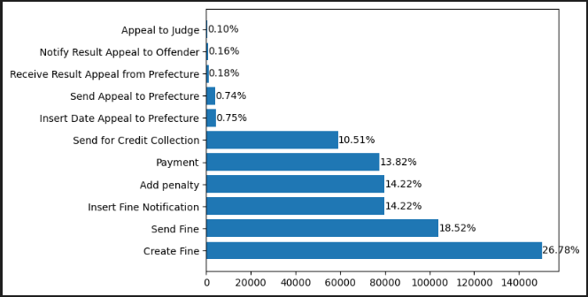

### Using PMTK:

The dataset was explored to gain insights into the number of events per case and the most common cases. This helped in identifying useful information and filtering out outliers that did not contribute significant insights.

#### Log Summary

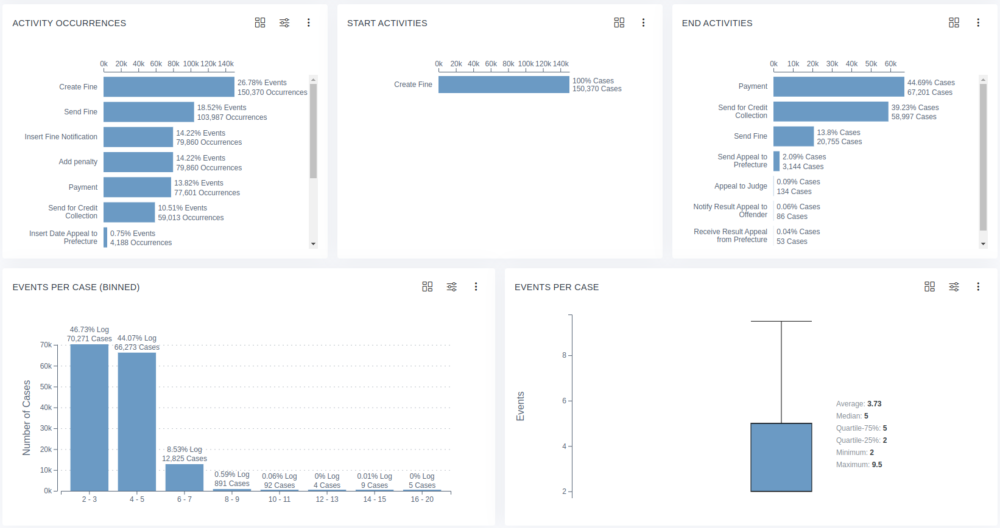

The summary adds information regarding the number of events per case, revealing the most common cases and helping me to understand which information are useful and which are not.

Then I had a look at the outliers, which doesn't provided any useful information.

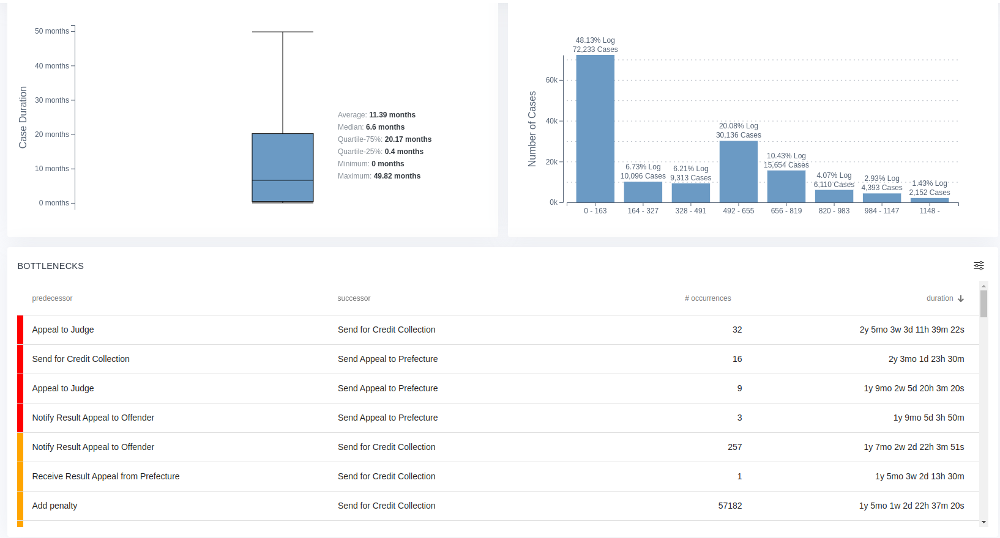

#### Throughput Time:


A substantial percentage of events conclude quickly, but many take longer, even excluding outliers. This suggests a need to optimize certain parts of the process. For instance, initiating credit collection promptly after adding a penalty could significantly reduce resolution times.

I then decided to sort the *Bottlenecks* section by occurrences:

 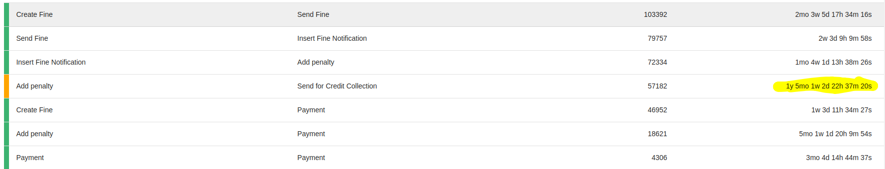

Even if I consider the issue between the creation of a fine and the actual fine, the bottleneck in terms of time doesn't seem too significant. Instead, the highlighted one is really important for my analysis. It suggests that *if credit collection was done right after adding a penalty, we could save a significant amount of time*.

Additionally, I discovered that `Send for Credit Collection` is mostly a final state, with only 16 occurrences where it is involved as a transition activity.


#### Dotted Chart:

First of all I provide the legend:

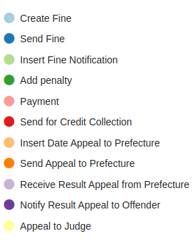

Then the chart:

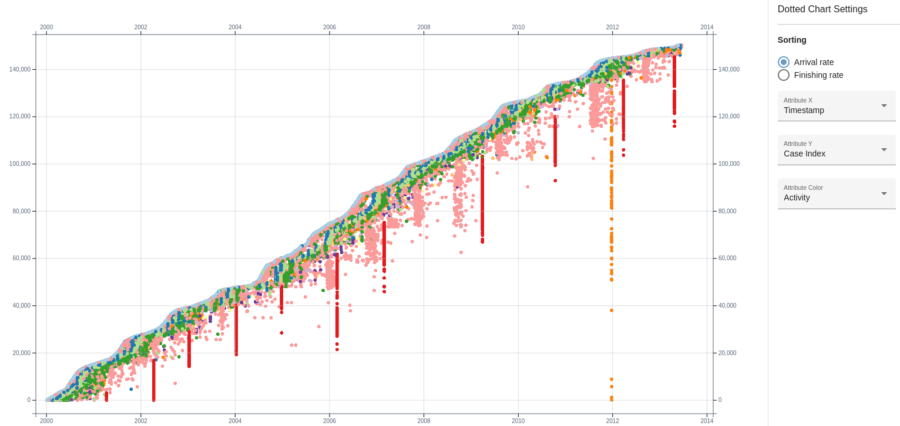

This chart reveals periodic activities, such as `Send for Credit Collection` and `Send Appeal to Prefecture'` 

The bottlenecks identified, such as delays between `Create Fine` and `Send Fine`, are less critical than those involving credit collection.

#### Horizon Chart:

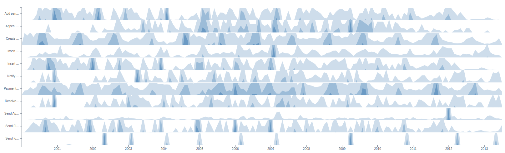

Confirms the periodicity of certain activities but indicates peaks rather than a consistent periodic pattern for others.

It confirms the periodicity of `Send for Credit Collection` but not the periodicity of `Send Appeal to Prefecture`, that just have a peak in $2012$.

#### Transition Matrix:

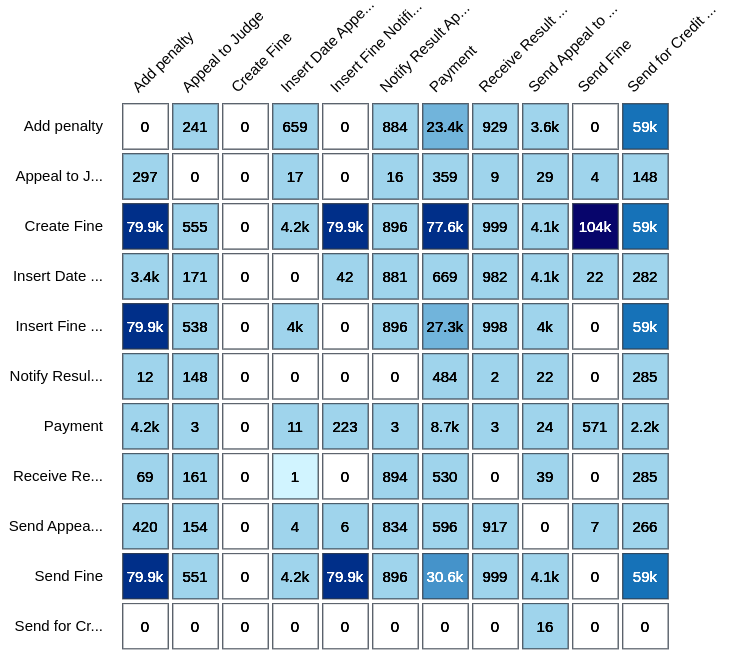

Highlights transitions, showing frequent transitions from `Payment` to `Payment`, the significant role of `Create Fine` as a starting point and `Send for Credit Collection` is not utilized for a transition.

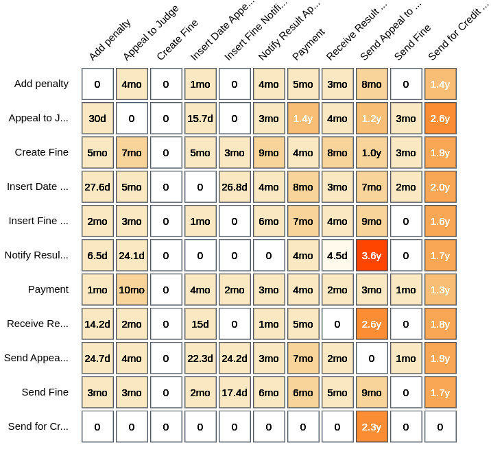

I have done the same consideration even with the performance filter, but here we can also observe bottlenecks (that often involves `Send for Credit Collection`).

By crossing the two matrix we can see the real bottlenecks:

- `Add penalty` -> `Send for Credit Collection`
- `Create Fine` -> `Send for Credit Collection`
- `Insert Fine Notification` -> `Send for Credit Collection`
- `Send Fine` -> `Send for Credit Collection`

There are others transition that can be valuable, like `Create Fine` -> `Insert Fine` but again, it seems that there is some bureaucracy in the middle of it and the time that pass between is not that much (~5m).

#### Variant Explorer:

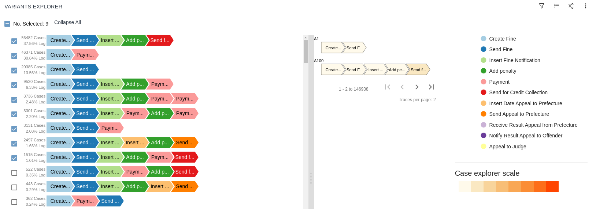

In the image above I have selected the variants that I am gonna consider in my analysis, so the threshold in this case is about ~1%, so I will explore only 4 of the End Activities.

#### Process Model:

Considering 75% of the cases:

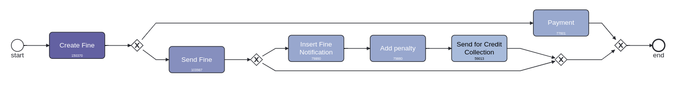

This model is not a surprise if we consider that the first three variants cover ~75%, but using a larger percentage make the model unreadable.

## The Knowledge Uplift Trail:

The KUT is used to turn raw data into insights full of meanings; it involves various steps that let us better understand the informations that those data provide. Some of the techniques of this methodology are listed below:

1. **Cleaning Data**, this step standardize data and fills or drops its missing values
2. **Filtering Data**, filters out some data in order to keep only the cases that meet specific conditions
3. **Descriptive Analysis**, it uses some tools to help understanding distribution and data characteristics 
4. **Process Mining**, it uses process mining techniques to discover the process
5. **Strategies** to improve and monitor the results of the previous steps

These are the steps that I have followed during the realization of this analysis:

| Step | Input              | Analytics            | Acquired Knowledge                                           | Type of Knowledge | Output                                                       |
| ---- | ------------------ | -------------------- | ------------------------------------------------------------ | ----------------- | ------------------------------------------------------------ |
| 1    | Event Logs         | Data Cleaning        | Standardization of `dismissal` and `amounts`, filling of `na` values | Descriptive       | Cleaned Event Logs                                           |
| 2    | Cleaned Event Logs | Descriptive Analysis | Data Filtering                                               | Descriptive       | Traces with a maximum of 9 cases, variants number reduced to 9, cases with a duration less than 1494.6 days |
| 3    | Filtered Cases     | Descriptive Analysis |                                                              | Descriptive       |                                                              |
| 4    |                    | Process Mining       | Process Discovery                                            | Descriptive       |                                                              |
| 5    |                    | Prescriptive         | Process optimization and simplification                      | Prescriptive      | Design of a simplified process to better understand the correct sequences of the activities |

### Cleaning Data:

Standardized values for dismissal and financial amounts to facilitate interpretation.

```python
def classify_dismissal(row):
    if row['dismissal'] in ['#','G']:
        return 'Y'
    elif row['dismissal'] == 'NIL' or pd.isna(row['dismissal']):
        return 'N'
    else:
        return '?'
original_event_log['dismissal'] = original_event_log.apply(classify_dismissal, axis=1)
```

```python
def classify_amounts(row):
    if row['concept:name'] == 'Create Fine' or row['concept:name'] == 'Add penalty':
        return row ['amount']
    elif row ['concept:name'] == 'Send Fine':
        return row['expense']
    elif row ['concept:name'] == 'Payment':
        return row['paymentAmount']
    else:
        return 0
original_event_log['amount'] = original_event_log.apply(classify_amounts, axis=1)
```

Then I filled the `na` values with `None` to avoid dropping rows:	

```python
original_event_log=original_event_log.fillna(0)						
```

### Filtering Data:

Next, I explored the dataset to examine the number of activities per trace, the variants that distinguish the dataset, and the duration of the traces in terms of days. Based on this analysis, we will refine the dataset with the following criteria:

1. **Maximum number of activities per trace**: Set to $9$ (since the box plot maximum is $9.5$, this criterion will trim the dataset effectively).
2. **Variants coverage**: Consider only the variants that cover at least $0.24$% of the cases in the event log. This way, we will cover approximately $98.6$% of all event logs.
3. **Maximum trace duration**: Set to $1'494.6$ days (according to the box plot maximum).

```python
# Filtering by the number of activities per trace
filtered_log = pm4py.filter_case_size(original_event_log, 1, 9)
# Filtering for the variants (we will cover ~98.6% of all of the event logs this way)
filtered_log = pm4py.filter_variants_top_k(filtered_log, 9)
# Filtering for duration on the remaining traces
case_durations = pm4py.get_all_case_durations(filtered_log)
# the durations are in seconds, so we need to convert them to days 
max_duration = ((1494.6*24)*60)*60
filtered_log = pm4py.filter_case_performance(filtered_log, min_performance=0, max_performance=max_duration)
```

## Statistical Analysis:

The main goal of this paragraph is to obtain descriptive statistics on the data distributions, in order to extract a time reference level (KPI) that distinguish the process.

### `Create Fine` - `Send Fine`:

One of the critical factor that determines if a case is a success is the period starting from the creation of a fine and its shipping. 

The scatter plot below shows the relation between the difference in days (that pass between creating a fine and sending it) and the frequency of them.

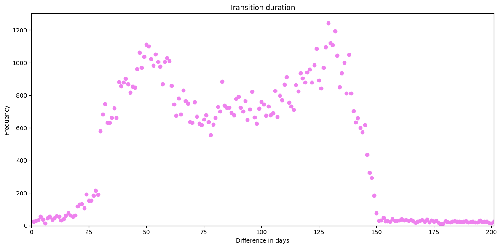

I also calculated this values (in days):

- Mean of the differences: 87.46225904371532
- Median of the differences: 87.0
- Sample Standard Deviation: 42.452027538816836

The *central tendency* suggests that fines are shipped within ~87 days with a variability states by the *standard deviation* of ~42 days.

Before trying to understand if the distribution is of type *normal*, I have splitted the cases into **Paid** and **Unpaid**, to see if those two groups follow the same:

#### Paid `Create&Send Fine`:


- Mean of the differences: 87.8281702374059
- Median of the differences: 89.0
- Sample Standard Deviation: 42.167763832413875

#### Unpaid `Create&Send Fine`:

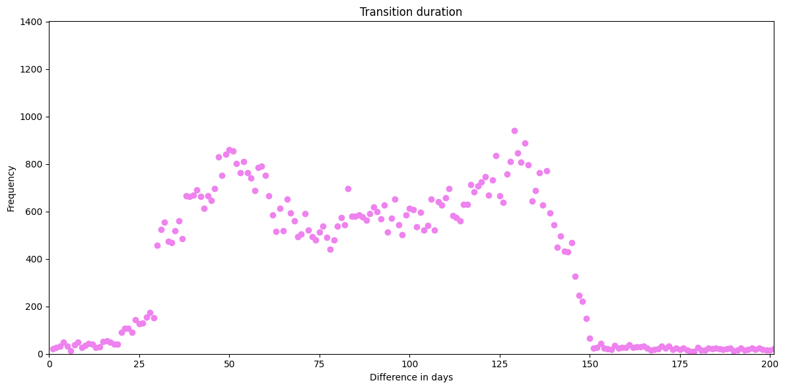

- Mean of the differences: 87.47244938665602 
- Median of the differences: 87.0 
- Sample Standard Deviation: 42.64077368893452

There aren't significant differences between the two distributions showed above, so I performed two different test for determine if this is a *normal distribution*:

```python
#perform Shapiro-Wilk test for normality
S_TestResult = shapiro(duration_frequency["Count"])
# Shapiro-Wilk pvalue: 1.1639578788109431e-25

#perform Kolmogorov-Smirnov test for normality
K_S_TestResult= kstest(duration_frequency["Count"], 'norm')
# Kolmogorov-Smirnov pvalue: 2.704684863512192e-297

if K_S_TestResult.pvalue > 0.05 and S_TestResult.pvalue > 0.05:
    print("There is not enough evidence to reject the null hypothesis that the data is normally distributed.")
else:
    print("The data is not normally distributed.")
```

Both the test, Shapiro-Wilk and Kolmogorov-Smirnov, returned p-values less than the threshold of 0.05, that states that the data *cannot be considered normally distributed*.

Moreover, the data *are not normally distributed* for both the **paid** and the **unpaid** cases.

### Process Discovery:

To summarizes the most frequent observed variants I realized the following table:

| Variant                                                      | Count |
| ------------------------------------------------------------ | ----- |
| 'Create Fine', 'Send Fine', 'Insert Fine Notification', 'Add penalty', 'Send for Credit Collection' | 56359 |
| Create Fine', 'Payment'                                      | 46371 |
| 'Create Fine', 'Send Fine'                                   | 20385 |
| 'Create Fine', 'Send Fine', 'Insert Fine Notification', 'Add penalty', 'Payment' | 9519  |
| 'Create Fine', 'Send Fine', 'Insert Fine Notification', 'Add penalty', 'Payment', 'Payment' | 3736  |
| 'Create Fine', 'Send Fine', 'Insert Fine Notification', 'Payment', 'Add penalty', 'Payment' | 3301  |
| 'Create Fine', 'Send Fine', 'Payment'                        | 3127  |
| 'Create Fine', 'Send Fine', 'Insert Fine Notification', 'Insert Date Appeal to Prefecture', 'Add penalty', 'Send Appeal to Prefecture' | 2273  |
| Create Fine', 'Send Fine', 'Insert Fine Notification', 'Add penalty', 'Payment', 'Send for Credit Collection' | 1508  |

How previously said, I have choose to maintain in the data only the top 9 variants. The majority of these variants terminates into the `Payment` activity, to be precise while considering the total number of cases the $45.06$% terminate on a `Payment`, while $39.48$% ends on `Send for Credit Collection`.

I used the following techniques, from PM4PY process discovery, to provide a gloabal view of these variants:

- **Heuristic miner**, that extends the **alpha miner** by including frequency and dependency metrics to improve the noise handling, by considering the most significant patterns in the Event Log:

  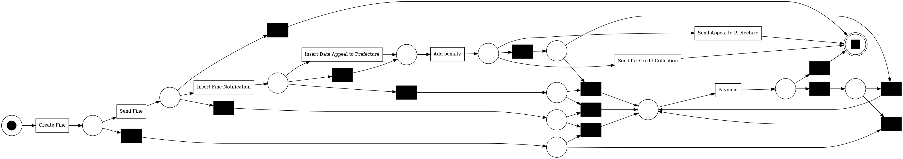

- **Inductive miner**, that works recursively, dividing the Event Log into smaller pieces until simple models can be discovered and combined:

  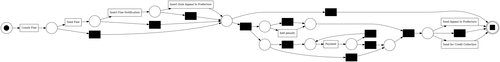	

These Petri Nets reflect what we have seen in the table above in a graphical way, moreover it can be great to combine the variants into smaller groups that shares the same end activity, to have a better look at the flow of the process, with the direct follow graph:

#### `Send for Credit Collection`

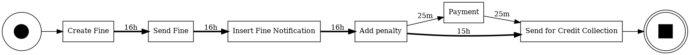

#### `Send Fine`

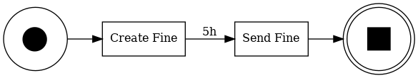

#### `Payment`

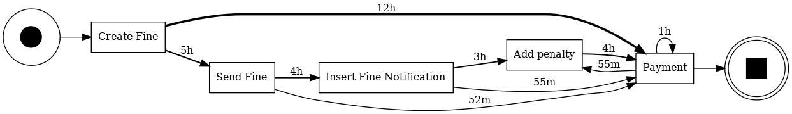

#### `Send Appeal to Prefecture`

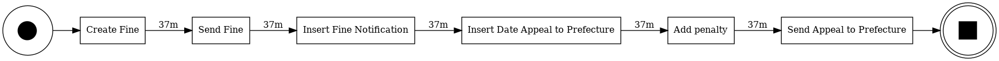

## Conformance Checking:

By comparing the filtered event logs (AS-IS) to the theoretical model (TO-BE), we assess process compliance.

```python
#Find diagnostic table
net, im, fm = pm4py.discover_petri_net_inductive(original_event_log, activity_key='concept:name', case_id_key='case:concept:name', timestamp_key='time:timestamp')
alignments_diagnostics = pm4py.conformance_diagnostics_alignments(original_event_log, net, im, fm, activity_key='concept:name', case_id_key='case:concept:name', timestamp_key='time:timestamp')
pm4py.view_alignments(filtered_log, alignments_diagnostics, format='png')
```

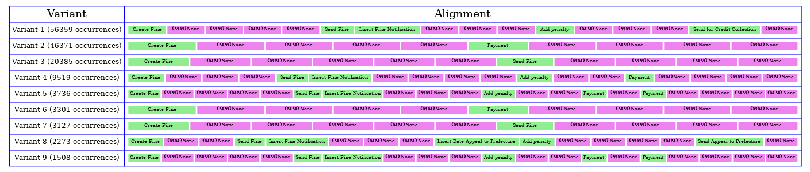

Using the Alpha Miner algorithm, we discovered the process model and evaluated its fitness against the event logs.

### Fitness for Original Event Log:

```py
# Discover a process model using the Alpha Miner algorithm
net, initial_marking, final_marking = pm4py.algo.discovery.alpha.algorithm.apply(original_event_log)
# Calculate the fitness of the event log against the discovered process model
fitness = pm4py.algo.evaluation.replay_fitness.algorithm.apply(original_event_log, net, initial_marking, final_marking)

# Print the results
print(f"average_trace_fitness: {fitness['average_trace_fitness']}")
print(f"log fitness: {fitness['log_fitness']}")
```

- **Average Trace Fitness**: $0.6741431381488104$
- **Log Fitness**: $ 0.637766272135165$

These scores are not so emotional as we wished, but it can be good if we refined the event log on which we compute the theoretical model.

Then I used the following code to extract an histogram with token based replay technique:

```python
net, im, fm = pm4py.discover_petri_net_alpha(original_event_log)
diagnostics = pm4py.conformance_diagnostics_token_based_replay(original_event_log, net, im, fm, return_diagnostics_dataframe=True)
frequency = diagnostics.groupby('trace_fitness').size().reset_index(name='count')

# Define histogram
plt.hist(diagnostics['trace_fitness'], bins=20, color='violet')
plt.xlabel('Fitness')
plt.ylabel('Frequency (observations)')
plt.title('Fitness Distribution')
plt.xlim(0, 1)
plt.xticks(np.arange(0, 1, 0.1))
plt.show()

# Calculate mean, median, and standard deviation of fitness
mean_difference = diagnostics['trace_fitness'].mean()
print(f"Mean of the fitness values: {mean_difference}")

median_difference = diagnostics['trace_fitness'].median()
print(f"Median of the fitness values: {median_difference}")

std_deviation = np.std(diagnostics['trace_fitness'], ddof=1)
print("Sample Standard Deviation of fitness values:", std_deviation)
```

That generated:

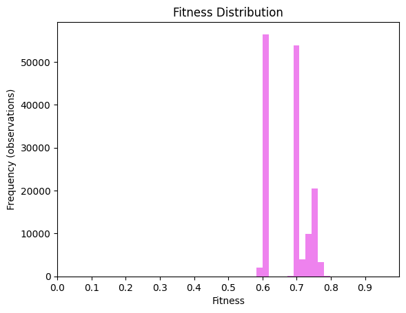

- **Mean of the fitness values**: $0.6741431381487306$ 
- **Median of the fitness values**: $0.7$ 
- **Sample Standard Deviation of fitness values**: $0.05799257077111415$

### Fitness for Filtered Event Log:

```python
# Discover a process model using the Alpha Miner algorithm
net, initial_marking, final_marking = pm4py.algo.discovery.alpha.algorithm.apply(filtered_log)
# Calculate the fitness of the event log against the discovered process model
fitness = pm4py.algo.evaluation.replay_fitness.algorithm.apply(filtered_log, net, initial_marking, final_marking)

# Print the results
print(f"average_trace_fitness: {fitness['average_trace_fitness']}")
print(f"log fitness: {fitness['log_fitness']}")
```

- **Average Trace Fitness**: $0.8145291945051658$
- **Log Fitness**: $0.8009576224898953$

These values represent a good result for a conformity analysis, the event logs seem generally compliant with the theoretical model represented by the *alpha* algorithm.

Then I used the following code to extract an histogram with token based replay technique:

```python
net, im, fm = pm4py.discover_petri_net_alpha(filtered_log)
diagnostics = pm4py.conformance_diagnostics_token_based_replay(filtered_log, net, im, fm, return_diagnostics_dataframe=True)
frequency = diagnostics.groupby('trace_fitness').size().reset_index(name='count')

# Define histogram
plt.hist(diagnostics['trace_fitness'], bins=20, color='violet')
plt.xlabel('Fitness')
plt.ylabel('Frequency (observations)')
plt.title('Fitness Distribution')
plt.xlim(0, 1)
plt.xticks(np.arange(0, 1, 0.1))
plt.show()

# Calculate mean, median, and standard deviation of fitness
mean_difference = diagnostics['trace_fitness'].mean()
print(f"Mean of the fitness values: {mean_difference}")

median_difference = diagnostics['trace_fitness'].median()
print(f"Median of the fitness values: {median_difference}")

std_deviation = np.std(diagnostics['trace_fitness'], ddof=1)
print("Sample Standard Deviation of fitness values:", std_deviation)
```

That generated:

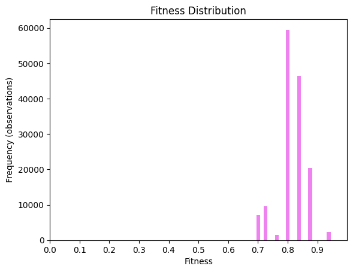

- **Mean of the fitness values**: $0.8145291945066301$
- **Median of the fitness values**: $0.8035714285714286$
- **Sample Standard Deviation of fitness values**: $0.046117420575037434$

## Organizational goals:

#### Organizational Goals

The goals are divided into three layers: Strategical, Operational, and Tactical.

- **Strategical**: *Reduce shipping time* for fines, *inefficiencies*, and *costs*.
- **Operational**: *Increase process compliance* and *identify bottlenecks*.
- **Tactical**: Utilize process mining techniques for flow analysis and real-time monitoring, *aiming to optimize the entire process*.

## Further Improvement:

To improve this analysis we can include an analysis based on the type of vehicle:

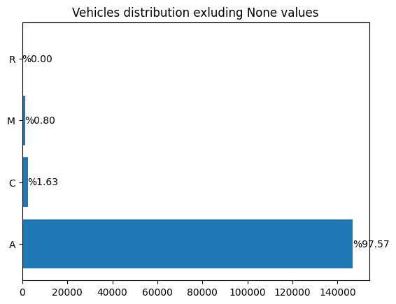

But we must consider to extend the classification because at the moment only the type `A` can provide meaningful information.

Also, we can classify the Fines for geographic area (cities, rural areas, peripheral areas, etc) and for gender of the offender and so on.

We can also try to identify patterns to reduce the variants number or try to categorize the type of Fines by better analyzing the Points:

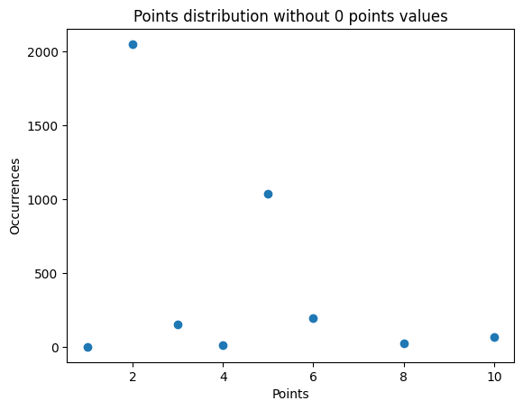

## Conclusion:

This comprehensive analysis of the road traffic fines management process highlights several areas for improvement. By addressing identified bottlenecks and optimizing the process flow, significant efficiency gains can be achieved. The next steps involve refining the event logs and continuing the analysis to develop a more streamlined and effective process model.

<hr>

Pietro Masolini  - 2023/2024 - University of Milan - Computer Science - Business Information Systems
