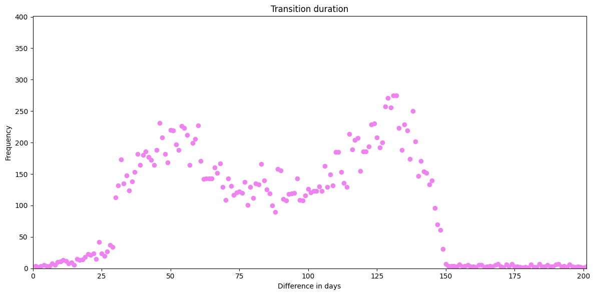

Pietro Masolini  - 2023/2024 - University of Milan - Computer Science

<hr>

# Road Traffic Fine Analysis

## Introduction:

The project aim to exploits process mining techniques to improve the management of road traffic  fines process.

To start we analyze the event logs collected by the police information system, in order to understand the statistical properties that distinguish cases.

The main goal is discover how the process is from event logs to then identify an optimal process on how the process ought to be.

## Data collection:

I started the project importing the `xes` file and converting it into a pandas dataframe using the `pm4py` library:

```python
original_event_log = pm4py.read_xes("../Assets/Road_Traffic_Fine_Management_Process.xes")
orginal_data_frame = pm4py.convert_to_dataframe(original_event_log)
```

Then I decided to take a look into the dataframe, obtaining the start and the end activities:

```python
start_activities = pm4py.get_start_activities(original_event_log)
end_activities = pm4py.get_end_activities(original_event_log)
```

As we all expect, a RTF, starts with a `Create Fine` activities and can end in many ways. Usually we think that should end with a payment, and the observation confirm this for the major part, still a great percentage of RTF also ends up with other activities. The table below shows a summary about it:

| Description      | Activities                                                   |
| ---------------- | ------------------------------------------------------------ |
| Start activities | *Create Fine* (150370)                                       |
| End activities   | *Send Fine* (20755)<br />*Send for Credit Collection*(58997)<br />*Payment* (67201)<br />*Send Appeal to Prefecture* (3144)<br />*Appeal to Judge* (134)<br />*Notify Result Appeal to Offender* (86)<br />*Receive Result Appeal from Prefecture* (53) |

## Initial considerations:

### Using python:

We should consider that an RTF that ends up with `Send Fine` is not a real end for our process, but just a checkpoint in the workflow. We should think the same for `Send for Credit Collection`, in fact it seems like another checkpoint that should end up into `Payment`, in this moment I am considering this activity like a reminder for the unpayed RTF, but I will make it sure in the future, analyze the time between a `Send Fine` and a `Send for Credit Collection` activity.

I also had a look at the percentage of all the activities, without considering them as a Start nor End points:


From this look I confirmed my previous thought about `Send Fine` was only a checkpoint in the traces because this kind of activities is listed ~$20000$ times as an end activity and ~$100000$ in total.

Unfortunately I cannot consider the same for the `Send for Credit Collection` activity, because the numbers confirm that it is a real end activity.

There is another discovery that I made up with this initial look, the activities `Add penalty` and `Insert Fine Notification` seems to be part of most of the traces of an RTF.

### Using PMTK:

To get a better understanding of the initial dataset I switched into PMTK to pursue a better knowledge.

#### Log Summary


The summary adds information regarding the number of events per case, revealing the most common cases and helping me to understand which information are useful and which are not.

Then I had a look at the outliers, which doesn't provided any useful information.


#### Throughput Time:


A good percentage of events (~$48.13$%) end up with a *fast* resolution, but there is also a lot events with a long time taken to resolve even if we exclude the outliers values (~$50$ months), due to this I may consider to cut off some of period to obtain a better analysis.

I then decided to sort the *Bottlenecks* section by occurrences:

 

Even if I consider a problem that between the creation of a fine and the actual fine, this bottlenecks doesn't seem too huge in terms of time. Instead, the highlighted one is really important for my analysis, it is suggesting me that *if credit collection was done right after adding a penalty we can save up so much time*.

Then I discovered that `Send for Credit Collection` is mostly a final state with only 16 occurrences that involves it as a transition activity:


#### Dotted Chart:

First of all I provide the legend:


Then the chart:


With a look at the chart we discover that `Send for Credit Collection` is a period event (or it is registered periodically) and his interval of time is increasedwith the number of RTF.I; `Send Appeal to Prefecture` is also periodic, so the bottleneck is somehow justified.

We can also see how the transition between `Create Fine` and `Send Fine` is not so important in terms of time if we have the fully paint in front of use.

#### Horizon Chart:

To confirm the periodicity of some activities I watched this chart with month as time unit (the same of the previous charts):


It confirms the periodicity of `Send for Credit Collection` but not the periodicity of `Send Appeal to Prefecture`, that just have a peak in $2012$.

#### Transition Matrix:


With a first look at the matrix I can safely say that there are a lot of transition from `Payment` to `Payment`, that the activity `Send for Credit Collection` is not utilized for a transition and the activity `Create Fine` is confirmed to be a starting point with the possibility of transitioning into all the other activities (not without some "preferences").


I have done the same consideration even with the performance filter, but here we can also observe bottlenecks (that often involves `Send for Credit Collection`).

By crossing the two matrix we can see the real bottlenecks:

- `Add penalty` -> `Send for Credit Collection`
- `Create Fine` -> `Send for Credit Collection`
- `Insert Fine Notification` -> `Send for Credit Collection`
- `Send Fine` -> `Send for Credit Collection`

There are others transition that can be valuable, like `Create Fine` -> `Insert Fine` but again, it seems that there is some bureaucracy in the middle of it and the time that pass between is not that much (~5m).

#### Variant Explorer:


In the image above I have selected the variants that I am gonna consider in my analysis, so the threshold in this case is about ~1%, so I will explore only 4 of the End Activities.

#### Process Model:

Considering 75% of the cases:


This model is not a surprise if we consider that the first three variants cover ~75%, but using a larger percentage make the model unreadable.

## The Knowledge Uplift Trail:

The KUT is used to turn raw data into insights full of meanings; it involves various steps that let us better understand the informations that those data provide. Some of the techniques of this methodology are listed below:

1. **Cleaning Data**, this step standardize data and fills or drops its missing values
2. **Filtering Data**, filters out some data in order to keep only the cases that meet specific conditions
3. **Descriptive Analysis**, it uses some tools to help understanding distribution and data characteristics 
4. **Process Mining**, it uses process mining techniques to discover the process
5. **Strategies** to improve and monitor the results of the previous steps

These are the steps that I have followed during the realization of this analysis:

| Step | Input              | Analytics            | Acquired Knowledge                                           | Type of Knowledge | Output                                                       |
| ---- | ------------------ | -------------------- | ------------------------------------------------------------ | ----------------- | ------------------------------------------------------------ |
| 1    | Event Logs         | Data Cleaning        | Standardization of `dismissal` and `amounts`, filling of `na` values | Descriptive       | Cleaned Event Logs                                           |
| 2    | Cleaned Event Logs | Descriptive Analysis | Data Filtering                                               | Descriptive       | Traces with a maximum of 9 cases, variants number reduced to 9, cases with a duration less than 1494.6 days |
| 3    | Filtered Cases     | Descriptive Analysis |                                                              | Descriptive       |                                                              |
| 4    |                    | Process Mining       | Process Discovery                                            | Descriptive       |                                                              |
| 5    |                    | Prescriptive         | Process optimization and simplification                      | Prescriptive      | Design of a simplified process to better understand the correct sequences of the activities |


### Cleaning Data:

I have standardized the values of the `dismissal` column to facilitate its interpretation:

```python
def classify_dismissal(row):
    if row['dismissal'] in ['#','G']:
        return 'Y'
    elif row['dismissal'] == 'NIL' or pd.isna(row['dismissal']):
        return 'N'
    else:
        return '?'
original_event_log['dismissal'] = original_event_log.apply(classify_dismissal, axis=1)
```

I have also standardized various financial values into a unified column called `amount`:

```python
def classify_amounts(row):
    if row['concept:name'] == 'Create Fine' or row['concept:name'] == 'Add penalty':
        return row ['amount']
    elif row ['concept:name'] == 'Send Fine':
        return row['expense']
    elif row ['concept:name'] == 'Payment':
        return row['paymentAmount']
    else:
        return 0
original_event_log['amount'] = original_event_log.apply(classify_amounts, axis=1)
```

Then I filled the `na` values with `None` to avoid dropping rows:	

```python
original_event_log=original_event_log.fillna(0)						
```

### Filtering Data:

Then I have explored the dataset to take a look *on the activity number for trace, the variants that distinguish the dataset and the duration of the traces in term of days*. In this step we will shorten the dataset with:

1. A maximum number of activities for trace as 9 (The box plot Maximum is 9.5, even if the point n.3 will cut up even more)
2. We will consider only the variants that cover at least 0.24% of the cases in the event log (we will cover ~98.6% of all of the event logs this way)
3. A maximum duration of the traces of 1494,6 days (The box plot Maximum)

```python
# Filtering by the number of activities per trace
filtered_log = pm4py.filter_case_size(original_event_log, 1, 9)
# Filtering for the variants (we will cover ~98.6% of all of the event logs this way)
filtered_log = pm4py.filter_variants_top_k(filtered_log, 9)
# Filtering for duration on the remaining traces
filtered_log = pm4py.filter_case_performance(filtered_log, min_duration=0, max_duration=1494.6*24)
```

## Statistical Analysis:

The main goal of this paragraph is to obtain descriptive statistics on the data distributions, in order to extract a time reference level (KPI) that distinguish the process.

### `Create Fine` - `Send Fine`:

One of the critical factor that determines if a case is a success is the period starting from the creation of a fine and its shipping. 

The scatter plot below shows the relation between the difference in days (that pass between creating a fine and sending it) and the frequency of them.


I also calculated this values (in days):

- Mean of the differences: 87.46225904371532
- Median of the differences: 87.0
- Sample Standard Deviation: 42.452027538816836

The *central tendency* suggests that fines are shipped within ~87 days with a variability states by the *standard deviation* of ~42 days.

Before trying to understand if the distribution is of type *normal*, I have splitted the cases into **Paid** and **Unpaid**, to see if those two groups follow the same:

#### Paid `Create&Send Fine`:



- Mean of the differences: 87.8281702374059
- Median of the differences: 89.0
- Sample Standard Deviation: 42.167763832413875

#### Unpaid `Create&Send Fine`:


- Mean of the differences: 87.47244938665602 
- Median of the differences: 87.0 
- Sample Standard Deviation: 42.64077368893452

There aren't significant differences between the two distributions showed above, so I performed two different test for determine if this is a *normal distribution*:

```python
#perform Shapiro-Wilk test for normality
S_TestResult = shapiro(duration_frequency["Count"])
# Shapiro-Wilk pvalue: 1.1639578788109431e-25

#perform Kolmogorov-Smirnov test for normality
K_S_TestResult= kstest(duration_frequency["Count"], 'norm')
# Kolmogorov-Smirnov pvalue: 2.704684863512192e-297

if K_S_TestResult.pvalue > 0.05 and S_TestResult.pvalue > 0.05:
    print("There is not enough evidence to reject the null hypothesis that the data is normally distributed.")
else:
    print("The data is not normally distributed.")
```

Both the test, Shapiro-Wilk and Kolmogorov-Smirnov, returned p-values less than the threshold of 0.05, that states that the data *cannot be considered normally distributed*.

Moreover, the data *are not normally distributed* for both the **paid** and the **unpaid** cases.

### Process Discovery:

To summarizes the most frequent observed variants I realized the following table:

| Variant                                                      | Count |
| ------------------------------------------------------------ | ----- |
| 'Create Fine', 'Send Fine', 'Insert Fine Notification', 'Add penalty', 'Send for Credit Collection' | 56359 |
| Create Fine', 'Payment'                                      | 46371 |
| 'Create Fine', 'Send Fine'                                   | 20385 |
| 'Create Fine', 'Send Fine', 'Insert Fine Notification', 'Add penalty', 'Payment' | 9519  |
| 'Create Fine', 'Send Fine', 'Insert Fine Notification', 'Add penalty', 'Payment', 'Payment' | 3736  |
| 'Create Fine', 'Send Fine', 'Insert Fine Notification', 'Payment', 'Add penalty', 'Payment' | 3301  |
| 'Create Fine', 'Send Fine', 'Payment'                        | 3127  |
| 'Create Fine', 'Send Fine', 'Insert Fine Notification', 'Insert Date Appeal to Prefecture', 'Add penalty', 'Send Appeal to Prefecture' | 2273  |
| Create Fine', 'Send Fine', 'Insert Fine Notification', 'Add penalty', 'Payment', 'Send for Credit Collection' | 1508  |

How previously said, I have choose to maintain in the data only the top 9 variants. The majority of these variants terminates into the `Payment` activity, to be precise while considering the total number of cases the $45.06$% terminate on a `Payment`, while $39.48$% ends on `Send for Credit Collection`.

I used the following techniques, from PM4PY process discovery, to provide a gloabal view of these variants:

- **Heuristic miner**, that extends the **alpha miner** by including frequency and dependency metrics to improve the noise handling, by considering the most significant patterns in the Event Log:

  

- **Inductive miner**, that works recursively, dividing the Event Log into smaller pieces until simple models can be discovered and combined:

  	

These Petri Nets reflect what we have seen in the table above in a graphical way, moreover it can be great to combine the variants into smaller groups that shares the same end activity, to have a better look at the flow of the process, with the direct follow graph:

#### `Send for Credit Collection`


#### `Send Fine`


#### `Payment`


#### `Send Appeal to Prefecture`


## Conformance Checking:

I compared my filtered Event Logs (AS-IS) to the TO-BE:

```python
#Find diagnostic table
net, im, fm = pm4py.discover_petri_net_inductive(original_event_log, activity_key='concept:name', case_id_key='case:concept:name', timestamp_key='time:timestamp')
alignments_diagnostics = pm4py.conformance_diagnostics_alignments(original_event_log, net, im, fm, activity_key='concept:name', case_id_key='case:concept:name', timestamp_key='time:timestamp')
pm4py.view_alignments(filtered_log, alignments_diagnostics, format='png')
```


### Fitness for Original Event Log:

```py
# Discover a process model using the Alpha Miner algorithm
net, initial_marking, final_marking = pm4py.algo.discovery.alpha.algorithm.apply(original_event_log)
# Calculate the fitness of the event log against the discovered process model
fitness = pm4py.algo.evaluation.replay_fitness.algorithm.apply(original_event_log, net, initial_marking, final_marking)

# Print the results
print(f"average_trace_fitness: {fitness['average_trace_fitness']}")
print(f"log fitness: {fitness['log_fitness']}")
```

- **Average Trace Fitness**: $0.6741431381488104$
- **Log Fitness**: $ 0.637766272135165$

These scores are not so emotional as we wished, but it can be good if we refined the event log on which we compute the theoretical model.

Then I used the following code to extract an histogram with token based replay technique:

```python
net, im, fm = pm4py.discover_petri_net_alpha(original_event_log)
diagnostics = pm4py.conformance_diagnostics_token_based_replay(original_event_log, net, im, fm, return_diagnostics_dataframe=True)
frequency = diagnostics.groupby('trace_fitness').size().reset_index(name='count')

# Define histogram
plt.hist(diagnostics['trace_fitness'], bins=20, color='violet')
plt.xlabel('Fitness')
plt.ylabel('Frequency (observations)')
plt.title('Fitness Distribution')
plt.xlim(0, 1)
plt.xticks(np.arange(0, 1, 0.1))
plt.show()

# Calculate mean, median, and standard deviation of fitness
mean_difference = diagnostics['trace_fitness'].mean()
print(f"Mean of the fitness values: {mean_difference}")

median_difference = diagnostics['trace_fitness'].median()
print(f"Median of the fitness values: {median_difference}")

std_deviation = np.std(diagnostics['trace_fitness'], ddof=1)
print("Sample Standard Deviation of fitness values:", std_deviation)
```

That generated:


- **Mean of the fitness values**: $0.6741431381487306$ 
- **Median of the fitness values**: $0.7$ 
- **Sample Standard Deviation of fitness values**: $0.05799257077111415$

### Fitness for Filtered Event Log:

```python
# Discover a process model using the Alpha Miner algorithm
net, initial_marking, final_marking = pm4py.algo.discovery.alpha.algorithm.apply(filtered_log)
# Calculate the fitness of the event log against the discovered process model
fitness = pm4py.algo.evaluation.replay_fitness.algorithm.apply(filtered_log, net, initial_marking, final_marking)

# Print the results
print(f"average_trace_fitness: {fitness['average_trace_fitness']}")
print(f"log fitness: {fitness['log_fitness']}")
```

- **Average Trace Fitness**: $0.8145291945051658$
- **Log Fitness**: $0.8009576224898953$

These values represent a good result for a conformity analysis, the event logs seem generally compliant with the theoretical model represented by the *alpha* algorithm.

Then I used the following code to extract an histogram with token based replay technique:

```python
net, im, fm = pm4py.discover_petri_net_alpha(filtered_log)
diagnostics = pm4py.conformance_diagnostics_token_based_replay(filtered_log, net, im, fm, return_diagnostics_dataframe=True)
frequency = diagnostics.groupby('trace_fitness').size().reset_index(name='count')

# Define histogram
plt.hist(diagnostics['trace_fitness'], bins=20, color='violet')
plt.xlabel('Fitness')
plt.ylabel('Frequency (observations)')
plt.title('Fitness Distribution')
plt.xlim(0, 1)
plt.xticks(np.arange(0, 1, 0.1))
plt.show()

# Calculate mean, median, and standard deviation of fitness
mean_difference = diagnostics['trace_fitness'].mean()
print(f"Mean of the fitness values: {mean_difference}")

median_difference = diagnostics['trace_fitness'].median()
print(f"Median of the fitness values: {median_difference}")

std_deviation = np.std(diagnostics['trace_fitness'], ddof=1)
print("Sample Standard Deviation of fitness values:", std_deviation)
```

That generated:


- **Mean of the fitness values**: $0.8145291945066301$
- **Median of the fitness values**: $0.8035714285714286$
- **Sample Standard Deviation of fitness values**: $0.046117420575037434$

## Organizational goals:

The organization needs to split its goals into 3 layer: *Strategical*, *Operational* and *Tactical*; each of them is addressed to a specific group of person. I have listed below the hypothetical goals of this organization: 

- **Strategical**
  1. Reduce the shipping time of the Fines, reduce the inefficiencies and the costs
     - **Operational**
       1. Increasing process compliance and identify the bottlenecks
          - **Tactical**
            1. Analyze the flows using process mining techniques
            2. Real time monitoring
       2. Optimize the allocation of resources
          - **Tactical**
            1. Training session for the staff to learn how to manage dysfunctional executions
            2. Automating the reminders to offenders
       3. Build some predictive models to classify the risks within the cases
          - **Tactical**
            1. Improving the data collection to extract more information (in a cleaner way)

## Further Improvement:

To improve this analysis we can include an analysis based on the type of vehicle:


But we must consider to extend the classification because at the moment only the type `A` can provide meaningful information.

Also, we can classify the Fines for geographic area (cities, rural areas, peripheral areas, etc) and for gender of the offender and so on.

We can also try to identify patterns to reduce the variants number or try to categorize the type of Fines by better analyzing the Points:


