# Collection of thoughts about the Data Set:

## First observations:

My first move was observing the start and the end activities and i have discovered the following result:
```
Start activities: 
    {'Create Fine': 150370}
End activities: 
    {'Send Fine': 20755,
     'Send for Credit Collection': 58997,
     'Payment': 67201, 
     'Send Appeal to Prefecture': 3144, 
     'Appeal to Judge': 134, 
     'Notify Result Appeal to Offender': 86, 
     'Receive Result Appeal from Prefecture': 53}
```
As we all expected a RTF (**Road Traffic Fine**) starts with a `Create Fine` activity and can end in many ways.

Usually we think that a RTF should end with a payment in majority, and this observation confirm this thought, but let us discover that a great percentage of RTF also ends up with `Send for Credit Collection` or (the third largest number) `Send Fine`.

We should consider that an RTF that ends up with `Send Fine` is not a real end for our process, but just a checkpoint in the workflow. We should think the same for `Send for Credit Collection`, in fact it seems like another checkpoint that should end up into `Payment`, in this moment I am considering this activity like a reminder for the unpayed RTF, but I will make it sure in the future, analyze the time between a `Send Fine` and a `Send for Credit Collection` activity.

Then I decided to have a global look at the percentage of all the activities, not considering them as Start/End points, and I have produced this bar graph with a percentage for each of the bar:

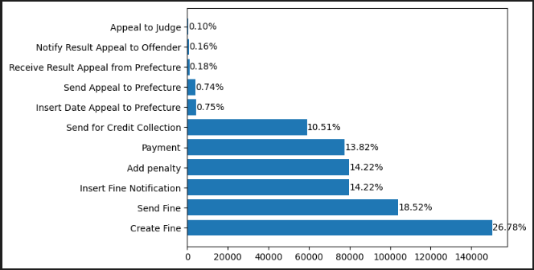

From a first look I saw how the activity `Create Fine` is only a Start one, and I have to exclude if I find it in the middle of a flow.

Then I confirmed my previous thought, the one where I was thinking about `Send Fine` as a checkpoint, in fact there are more than 100,000 of it in the Event Log and only, more or less, 20,000 as End Activity.

I cannot say the same for `Send for Credit Collection` unfortunatly. The numbers confute my theory, and I am now considering this activity as a real End one.

I am also surprised by the activities `Add penalty` and `Insert Fine Notification` that, observing this graph, seems to be part of most of the work flow of an RTF.

## First observation in PMTK:

Then i switched from the notebook into PMTK, seeking for confirm and more information in a easy way. So i decide to have a look into the *Log Summary*:

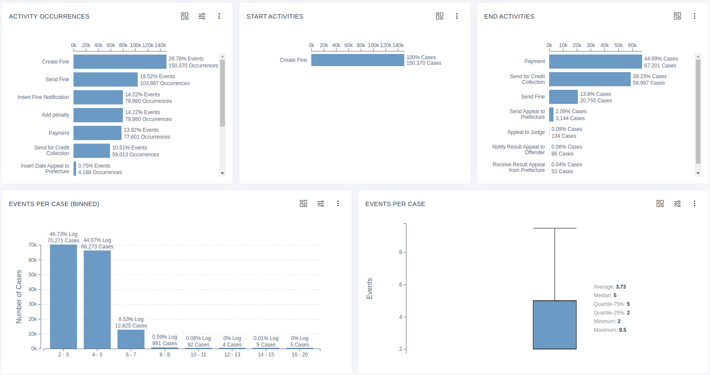

The summary confirmed me what I have seen before, adding informations regarding the number of events per case, revealing the most common cases and helping me to understand which infos are usefull are which are not. In this case I am thinking to drop all of the cases that involve more than 7 cases. 

Then I had a look at the outliers, that compared to the total number of cases are a ridicolous amount, and they do not provide any usefull infos.

Then I took a look into the *Throughput Time* section:

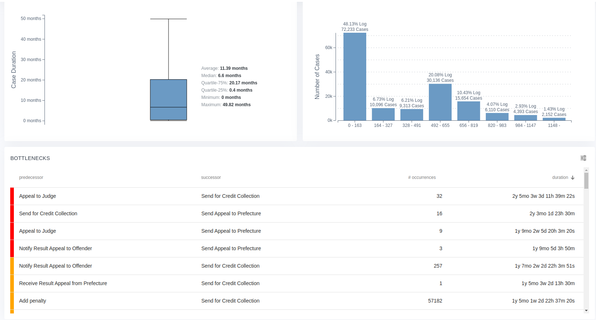

As I have done before I didn't include the outliers in the image, but I have to say that in this case they are more than what I expected so, maybe, they deserve a look.

For god sake a good percentage of events (~48.13%) end up with a "fast" resolution, but there is also a lot of events that are not so "fast" even if we exclude the outliers values (~50 months and more) so, again, I may consider to cut off some period to have a better analysis (I am thinking to consider only the events lower than 35 months).

Then my eyes focused on the *Bottlenecks* section, where I found out 4 main transition that are time critical, but the occurences of these transition is so low that it is not a big issue...

So I have decided to sort the bottlenecks by occurrences:

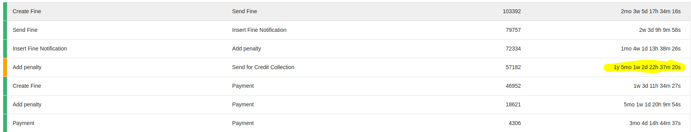

Even if I consider wrong that it is so common let pass 2 months between the creation of a fine and the actual fine, this bottlenecks is not so huge in terms of time. Instead, the highlighted one is really important for my analysis, it is suggesting me that if the credit collection was done right after the adding of a penalty we can save up so much time!

I also investigated on the `Send for Credit Collection` and I have discovered (as we seen before) that it is, mostly, a final state of the event, with only 16 occurences that involve it as a transition state:

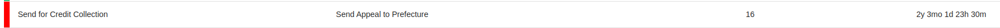

As I said earlier we can ignore this bottlenecks for the small number of occurences, but we cannot ignore how this final state is reached to slowly, it is the first real problem of this process...

Then I switched on the `Dotted Chart`, but first there is a small legend:

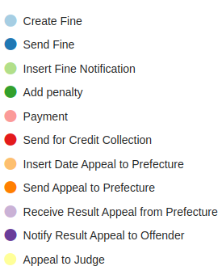

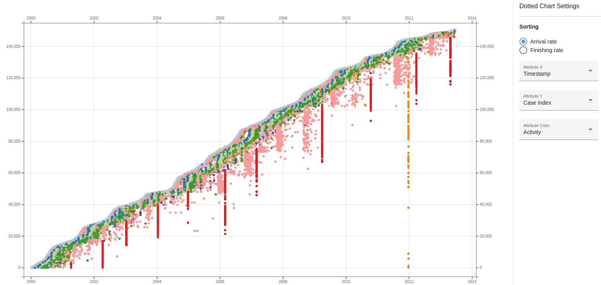

In this chart I observed how the case `Send for Credit Collection` is a periodic event and his interval of time is increased proportionally with number of RTF. I 

I also observed that the activity `Send Appeal to Prefecture` is also periodic, so the bottleneck is justified by this periodic operation.

This two observation are justified but, especially the first one, they shouldn't been periodical, the time that they consume is really to much for the process.

In this chart we can also see how the transition between the `Create Fine` and `Send Fine` activities is not so important in term of times if we have the fully paint in front of us.

To confirm the periodicity of some activities I watched the *Horizon Chart*, with month as time unit (I always used month in the previous charts):

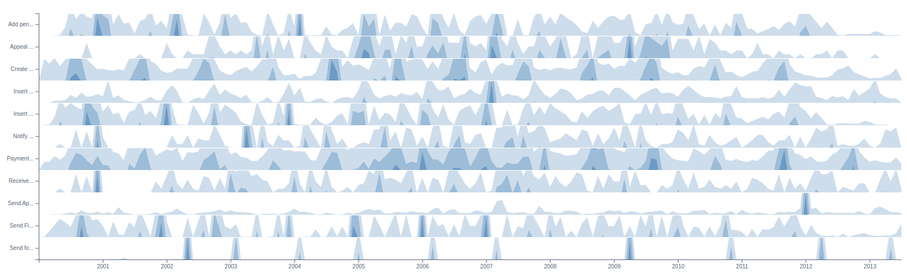

This chart confirmed the periodicity of `Send for Credit Collection` but not the periodicity of `Send Appeal to Prefecture, that just have a peak in 2012!

The *Performance View* just displayed the timing of the various traces and the timestamp of the transition between activities. At the moment it doesn't add nothing to my knwoledge. Maybe it can help me when I have to indagate into some specific activities.

The *Sunburst Plot* didn't give me nothing new.

Instead the *Transition Matrix* has given me something:

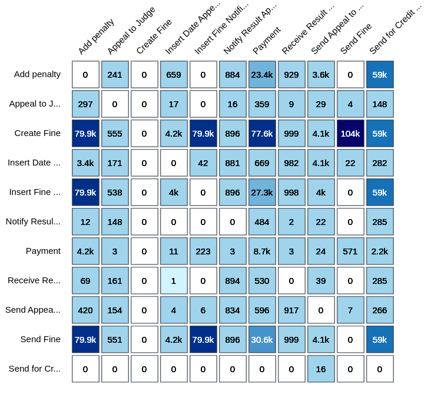

Talking about the frequency filter I can say that there are much transition `Payment` to `Payment` that doesn't satisfy me, but maybe they are only double payment due to credit card limit or something, I will look into it.

The acitivy `Send for Credit Collection` is not used for transition, only in 16 occurences, that make me think that this transition is not relevant at all.

The activity `Create Fine` is confirmed as starting point and it can transition into all the other activities, but with some preferences.

Same considerations for the performance filter of the matrix:

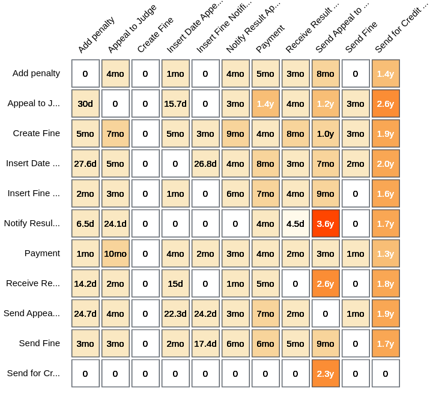

Here we can also observe the bottlenecks, that often involve `Send for Credit Collection` as I said before, but the process seems to have burocracy issue for this particular activity.

To individuate the real bottlenecks we have to cross the two matrix and see where both years and occurences are over a thresold. Here is a list of these points:

- `Add penalty` -> `Send for Credit Collection`
- `Create Fine` -> `Send for Credit Collection`
- `Insert Fine Notification` -> `Send for Credit Collection`
- `Send Fine` -> `Send for Credit Collection`

There are others transition that can be valuable, like `Create Fine` -> `Insert Fine` but again, it seems that there is some burocracy in the middle of it and the time that pass between is not that much (~5m).

To finish the *Visual Analytics* of PMTK I also watched the *Variant Explorer*:

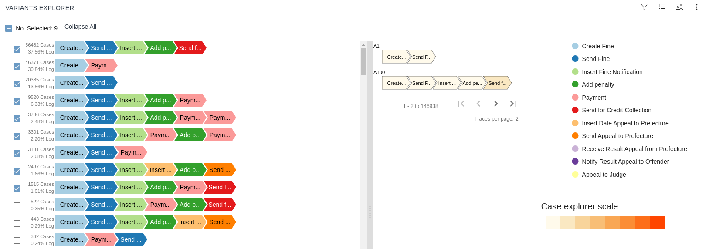

I have selected the variants that I am gonna consider in my analysis, so the threesold in this case would be > 1%. Using this threesold I am gonna explore only 4 of the End Activities! Excluding a lot of cases that are not relevent or "pattern like", but to be sure of this last sentences I have to apply some comparative model or something to individuate the real patterns or similar transitions...

Considering 75% of the cases the *Process Model* result like:

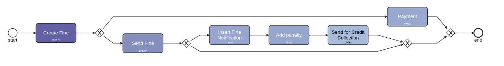

That is not really a surprise if we consider that the first tree variants cover all of this 75%, but using a larger percentage make the model unreadable.

Now that I have watched all "on the fly" I can follow the project guidelines to build a correct strategy for my analysis!

## Specific observations: